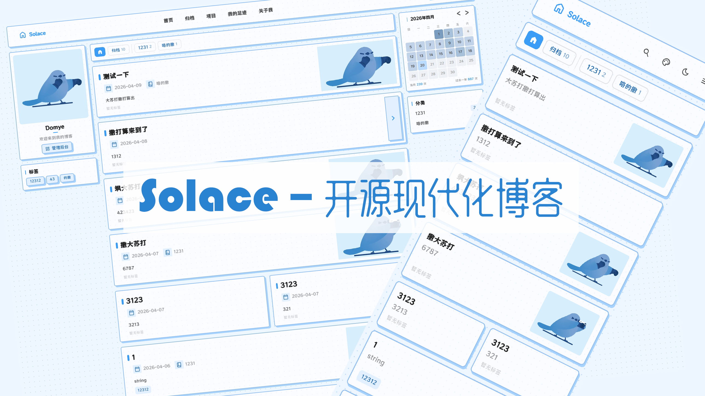

<div align="center">

# Solace

**A Modern Full-Stack Blog System**

[](https://golang.org/)
[](https://react.dev/)
[](https://www.typescriptlang.org/)
[](LICENSE)

[Features](#-features) • [Tech Stack](#-tech-stack) • [Quick Start](#-quick-start) • [Architecture](#-architecture) • [API Docs](#-api-documentation)

[**简体中文**](./README_CN.md) | English



</div>

---

## Overview

**Solace** is a production-ready, full-stack **blog system** built with **Go (Golang)**, **React**, **TypeScript**, and **PostgreSQL**. It features a high-performance **Go backend** with **clean architecture** and a responsive **React frontend** with an exceptional developer experience.

Perfect for developers looking for a **modern blog platform**, **personal website**, **developer blog**, or **tech blog**. Ideal for learning **full-stack development**, **clean architecture**, **REST API design**, and **Docker deployment**.

The system supports **article management** with **Markdown**, **category/tag organization**, **photo albums** with **lazy loading**, **visitor footprint visualization**, **SEO optimization**, and **dark mode** support.

## ✨ Features

### Content Management
- 📝 **Markdown Editor** - Full Markdown support with syntax highlighting
- 🏷️ **Categories & Tags** - Flexible content organization system
- 🖼️ **Photo Albums** - Lazy loading images with lightbox viewer
- 🔍 **Full-text Search** - Fast article search functionality

### User Experience
- 📊 **Visitor Footprints** - ECharts-powered world map visualization
- 🌙 **Dark Mode** - Auto-follow system preference
- 📱 **Responsive Design** - Mobile-first, works on all devices
- ⚡ **Performance Optimized** - Code splitting, lazy loading, CDN ready

### Technical Excellence
- 🔐 **JWT Authentication** - Secure user authentication
- 📖 **Auto API Docs** - Swagger/OpenAPI documentation
- 🐳 **Docker Ready** - Containerized deployment
- 🔄 **Hot Reload** - Fast development iteration

## 🛠 Tech Stack

### Backend

| Category | Technology |
|----------|------------|
| Language | Go 1.25+ |
| Framework | Gin |
| ORM | GORM |
| Database | PostgreSQL |
| Auth | JWT (golang-jwt) |
| Logging | zerolog |
| API Docs | Swagger (swaggo) |
| Config | TOML |

### Frontend

| Category | Technology |
|----------|------------|
| Framework | React 18 |
| Language | TypeScript 5.6 |
| Build Tool | Vite 6 |
| Styling | Tailwind CSS 3 |
| State (Server) | TanStack Query |
| State (Client) | Zustand |
| Routing | React Router 7 |
| Forms | React Hook Form + Zod |
| Charts | ECharts |
| Icons | Iconify |

## 📦 Project Structure

```
.
├── backend/                    # Go backend service
│   ├── cmd/                    # Application entrypoints
│   │   └── server/main.go      # Server entry point
│   ├── internal/               # Private application code
│   │   ├── handler/            # HTTP handlers (controllers)
│   │   ├── service/            # Business logic layer
│   │   ├── repository/         # Data access layer
│   │   ├── model/              # Domain entities
│   │   ├── middleware/         # HTTP middlewares
│   │   └── docs/               # Swagger documentation
│   ├── migrations/             # Database migrations
│   ├── config.toml.example     # Configuration template
│   ├── Dockerfile              # Backend container
│   └── Makefile                # Build automation
│
├── frontend/                   # React frontend application
│   ├── src/
│   │   ├── components/         # Reusable UI components
│   │   │   ├── ui/             # Base UI primitives
│   │   │   └── layout/         # Layout components
│   │   ├── features/           # Feature-based modules
│   │   │   ├── articles/       # Article feature
│   │   │   ├── auth/           # Authentication
│   │   │   ├── gallery/        # Photo albums
│   │   │   └── admin/          # Admin dashboard
│   │   ├── hooks/              # Custom React hooks
│   │   ├── api/                # API client & types
│   │   ├── stores/             # Zustand stores
│   │   ├── utils/              # Utility functions
│   │   └── types/              # TypeScript definitions
│   ├── public/                 # Static assets
│   ├── Dockerfile              # Frontend container
│   └── nginx.conf              # Nginx configuration
│
├── docker-compose.yml          # Docker Compose orchestration
├── build-docker.sh             # Docker build script
└── README.md                   # This file
```

## 🚀 Quick Start

### Prerequisites

- **Go** 1.25 or later
- **Node.js** 18 or later
- **PostgreSQL** 15 or later
- **Docker** (optional, for containerized deployment)

### Option 1: Local Development

#### 1. Clone the Repository

```bash
git clone https://github.com/domye/Solace.git
cd Solace
```

#### 2. Backend Setup

```bash
cd backend

# Copy and configure environment
cp config.toml.example config.toml
# Edit config.toml with your database credentials

# Install dependencies and run
go mod download
go run cmd/server/main.go
```

Backend will be available at `http://localhost:8080`

#### 3. Frontend Setup

```bash
cd frontend

# Install dependencies
npm install

# Start development server
npm run dev
```

Frontend will be available at `http://localhost:5173`

### Option 2: Docker Deployment

```bash
# Create config directory
mkdir -p config
cp backend/config.toml.example config/config.toml

# Edit configuration
# vim config/config.toml

# Start all services
docker-compose up -d
```

Services:
- Frontend: `http://localhost:8088`
- Backend API: `http://localhost:8080`
- API Docs: `http://localhost:8080/swagger/index.html`

## 🏗 Architecture

### Backend Architecture (Clean Architecture)

```
┌─────────────────────────────────────────────────────────────┐
│                        Handler Layer                         │
│              (HTTP Request/Response Handling)                │
├─────────────────────────────────────────────────────────────┤
│                        Service Layer                         │
│                  (Business Logic & Orchestration)            │
├─────────────────────────────────────────────────────────────┤
│                      Repository Layer                        │
│                   (Data Access & Queries)                    │
├─────────────────────────────────────────────────────────────┤
│                        Model Layer                           │
│                     (Domain Entities)                        │
└─────────────────────────────────────────────────────────────┘
```

### Frontend Architecture

```
┌─────────────────────────────────────────────────────────────┐
│                          Pages                               │
│                   (React Router Routes)                      │
├─────────────────────────────────────────────────────────────┤
│                      Features                                │
│          (Feature-based module organization)                 │
├─────────────────────────────────────────────────────────────┤
│                     Components                               │
│              (Reusable UI components)                        │
├─────────────────────────────────────────────────────────────┤
│                       Hooks                                  │
│           (Custom hooks for data & behavior)                 │
├─────────────────────────────────────────────────────────────┤
│              API Client & Stores                             │
│    (TanStack Query + Zustand for state management)          │
└─────────────────────────────────────────────────────────────┘
```

## 📖 API Documentation

After starting the backend, access the Swagger documentation at:

```
http://localhost:8080/swagger/index.html
```

### API Endpoints Overview

| Method | Endpoint | Description |
|--------|----------|-------------|
| `GET` | `/api/v1/articles` | List all articles |
| `GET` | `/api/v1/articles/:slug` | Get article by slug |
| `POST` | `/api/v1/articles` | Create article (auth required) |
| `PUT` | `/api/v1/articles/:id` | Update article (auth required) |
| `DELETE` | `/api/v1/articles/:id` | Delete article (auth required) |
| `GET` | `/api/v1/categories` | List categories |
| `GET` | `/api/v1/tags` | List tags |
| `GET` | `/api/v1/albums` | List photo albums |
| `POST` | `/api/v1/auth/login` | User login |
| `POST` | `/api/v1/auth/register` | User registration |

## 📝 Available Scripts

### Backend

```bash
# Development
go run cmd/server/main.go

# Build
go build -o bin/server cmd/server/main.go

# Tests
go test ./... -cover

# Lint
golangci-lint run

# Generate Swagger docs
swag init -g cmd/server/main.go -o internal/docs
```

### Frontend

```bash
# Development
npm run dev

# Build
npm run build

# Preview production build
npm run preview

# Type checking
npm run typecheck

# Lint
npm run lint
```

## 🔧 Configuration

### Backend (config.toml)

```toml
[server]
port = 8080
mode = "debug"  # debug, release, test

[database]
host = "localhost"
port = 5432
name = "blog"
user = "postgres"
password = "your_password"

[jwt]
secret = "your_jwt_secret"
expire = 24  # hours
```

### Frontend Environment

| Variable | Description | Default |
|----------|-------------|---------|
| `VITE_API_BASE` | Backend API URL | `/api/v1` |
| `SITE_BASE_URL` | Site base URL | - |
| `SITE_NAME` | Site name | `Solace` |
| `SITE_DESCRIPTION` | Site description | - |

## 🤝 Contributing

Contributions are welcome! Please feel free to submit a Pull Request.

1. Fork the repository
2. Create your feature branch (`git checkout -b feature/AmazingFeature`)
3. Commit your changes (`git commit -m 'Add some AmazingFeature'`)
4. Push to the branch (`git push origin feature/AmazingFeature`)
5. Open a Pull Request

## 📄 License

This project is licensed under the MIT License - see the [LICENSE](LICENSE) file for details.

## 🙏 Acknowledgments

- [Gin](https://github.com/gin-gonic/gin) - HTTP web framework
- [GORM](https://gorm.io/) - ORM library
- [React](https://react.dev/) - UI library
- [Tailwind CSS](https://tailwindcss.com/) - CSS framework
- [TanStack Query](https://tanstack.com/query) - Data fetching

---

<div align="center">


**[⬆ Back to Top](#solace)**

Made with ❤️ by [domye](https://github.com/domye)

</div>

---

<!-- SEO Keywords for Search Engine Discovery -->

<!--
Keywords: blog, blog system, blog platform, personal blog, blog engine, 开源博客, 博客系统, 个人博客, 博客平台, Go blog, React blog, TypeScript blog, Gin blog, GORM blog, PostgreSQL blog, full-stack blog, fullstack blog, 前后端分离博客, 全栈博客, modern blog, markdown blog, markdown 编辑器, Markdown 博客, dark mode blog, 深色模式博客, SEO blog, SEO 博客, 响应式博客, responsive blog, Vite blog, Tailwind CSS blog, React 18 blog, Go 1.25 blog, Go Gin blog, Gin framework, GORM, TanStack Query blog, Zustand blog, React Router blog, JWT authentication blog, JWT 认证, Docker blog, Docker 部署博客, containerized blog, 容器化博客, Clean Architecture blog, clean architecture, 整洁架构, DDD blog, Domain Driven Design, 领域驱动设计, blog template, 博客模板, blog starter, 博客脚手架, blog boilerplate, 博客框架, self-hosted blog, 自托管博客, personal website, 个人网站, portfolio blog, 作品集博客, developer blog, 开发者博客, tech blog, 技术博客, programming blog, 编程博客, code blog, 代码博客, article management, 文章管理, CMS, content management system, 内容管理系统, photo album, 相册, gallery blog, 图库博客, category tags, 分类标签, visitor tracking, 访客统计, ECharts visualization, ECharts 可视化, 地图可视化, visitor footprints, 访客足迹, syntax highlighting, 语法高亮, code highlighting, 代码高亮, lazy loading, 懒加载, performance optimization, 性能优化, fast blog, 高速博客, secure blog, 安全博客, REST API blog, RESTful API, Swagger API, OpenAPI, API documentation, API 文档, PostgreSQL, React, Go, Golang, TypeScript, Vite, Tailwind, Zustand, React Query, React Hook Form, Zod, ECharts, Iconify, nginx, JWT, zerolog, TOML, GitHub, open source, 开源项目, free blog, 免费博客, MIT license, MIT 许可证, blog tutorial, 博客教程, how to build a blog, 如何搭建博客, build blog with Go, 用 Go 搭建博客, build blog with React, 用 React 搭建博客, full stack development, 全栈开发, web development, 网站开发, frontend development, 前端开发, backend development, 后端开发, database design, 数据库设计, software architecture, 软件架构, best practices, 最佳实践, production ready, 生产就绪, scalable blog, 可扩展博客, maintainable code, 可维护代码, testable code, 可测试代码, CI CD blog, 持续集成, continuous integration, GitHub Actions, 自动化部署, automated deployment, cloud deployment, 云部署, server deployment, 服务器部署, Linux blog, Linux 部署, Windows blog, Windows 部署, macOS blog, macOS 部署, cross-platform, 跨平台, mobile friendly, 移动端友好, PWA blog, progressive web app, 渐进式网页应用, SSR blog, server side rendering, 服务端渲染, CSR blog, client side rendering, 客户端渲染, SPA blog, single page application, 单页应用, MPA blog, multi page application, 多页应用, SEO friendly, SEO 友好, search engine optimization, 搜索引擎优化, Google SEO, Baidu SEO, Bing SEO, sitemap, 站点地图, robots txt, meta tags, 元标签, Open Graph, Twitter Cards, structured data, 结构化数据, JSON LD, RSS feed, RSS 订阅, Atom feed, web performance, 网页性能, Core Web Vitals, LCP, FID, CLS, page speed, 页面速度, load time, 加载时间, bundle size, 打包体积, tree shaking, code splitting, 代码分割, dynamic import, 动态导入, image optimization, 图片优化, compression, 压缩, minification, 混淆压缩, caching, 缓存, CDN, content delivery network, 内容分发网络, security headers, 安全头, HTTPS, SSL, TLS, encryption, 加密, password hashing, 密码哈希, bcrypt, SQL injection prevention, SQL 注入防护, XSS prevention, XSS 防护, CSRF protection, CSRF 防护, rate limiting, 限流, input validation, 输入验证, error handling, 错误处理, logging, 日志, monitoring, 监控, alerting, 告警, backup, 备份, restore, 恢复, migration, 迁移, version control, 版本控制, Git, branching strategy, 分支策略, code review, 代码审查, pull request, issue tracking, 问题追踪, project management, 项目管理, documentation, 文档, README, CHANGELOG, CONTRIBUTING, LICENSE, community, 社区, support, 支持, contribution, 贡献, sponsor, 赞助, donation, 捐赠, star, fork, watch, follow, share, 分享, like, 点赞, comment, 评论, feedback, 反馈, feature request, 功能请求, bug report, Bug 报告, improvement, 改进, update, 更新, upgrade, 升级, changelog, 更新日志, release notes, 发布说明, version history, 版本历史, roadmap, 路线图, future plans, 未来计划, development status, 开发状态, maintenance, 维护, active development, 积极开发, stable release, 稳定版本, latest version, 最新版本, download, 下载, install, 安装, setup, 设置, configuration, 配置, customization, 自定义, theme, 主题, plugin, 插件, extension, 扩展, integration, 集成, third party, 第三方, analytics, 分析, Google Analytics, 百度统计, multi language, 多语言, i18n, internationalization, 国际化, localization, 本地化, translation, 翻译, accessibility, 可访问性, a11y, WCAG, ADA compliance, screen reader, 屏幕阅读器, keyboard navigation, 键盘导航, ARIA, semantic HTML, 语义化 HTML, web standards, 网页标准, W3C, HTML5, CSS3, ES6, ES2023, JavaScript, JS, TS, Node.js, npm, yarn, pnpm, package manager, 包管理器, dependency management, 依赖管理, responsive images, 响应式图片, webp, avif, image format, 图片格式, vector graphics, 矢量图形, SVG, canvas, WebGL, animation, 动画, transition, 过渡, transform, 变换, CSS Grid, Flexbox, 布局, layout, typography, 排版, font, 字体, Google Fonts, custom fonts, 自定义字体, icon font, 图标字体, SVG icons, SVG 图标, favicon, 网站图标, manifest, 清单文件, service worker, 服务工作线程, offline support, 离线支持, push notification, 推送通知, web push, 消息推送, real-time, 实时, WebSocket, SSE, Server-Sent Events, polling, 轮询, long polling, 长轮询, streaming, 流式传输, file upload, 文件上传, file download, 文件下载, drag and drop, 拖拽, copy paste, 复制粘贴, keyboard shortcut, 快捷键, context menu, 右键菜单, modal, 模态框, tooltip, 提示框, popover, 弹出框, dropdown, 下拉菜单, autocomplete, 自动完成, search, 搜索, filter, 筛选, sort, 排序, pagination, 分页, infinite scroll, 无限滚动, virtual scroll, 虚拟滚动, table, 表格, data grid, 数据网格, form, 表单, validation, 验证, submission, 提交, success message, 成功消息, error message, 错误消息, loading state, 加载状态, skeleton screen, 骨架屏, placeholder, 占位符, empty state, 空状态, 404 page, 404 页面, error page, 错误页面, maintenance mode, 维护模式, coming soon, 即将推出, under construction, 建设中

Related Projects: Hexo, Hugo, Jekyll, WordPress, Ghost, Gatsby, Next.js blog, Nuxt.js blog, Astro blog, VuePress, VitePress, Docusaurus, Notion blog, Medium alternative, WordPress alternative, Ghost alternative, blog alternatives, 博客替代方案

Programming Languages: Go, Golang, React, TypeScript, JavaScript, SQL, HTML, CSS, Markdown

Frameworks: Gin, GORM, React, Vite, Tailwind CSS, TanStack Query, Zustand, React Router, React Hook Form, Zod, ECharts, Swagger, OpenAPI

Databases: PostgreSQL, MySQL, SQLite, MongoDB, Redis, database, 数据库

Deployment: Docker, Docker Compose, Kubernetes, K8s, Nginx, Caddy, Apache, IIS, reverse proxy, 反向代理, load balancer, 负载均衡, cloud, 云服务, AWS, Azure, GCP, Aliyun, Tencent Cloud, 阿里云, 腾讯云, VPS, dedicated server, 独立服务器

Development Tools: VS Code, GoLand, WebStorm, IntelliJ IDEA, Git, GitHub, GitLab, Bitbucket, CI/CD, Jenkins, CircleCI, Travis CI, GitHub Actions

Learning Resources: tutorial, 教程, documentation, 文档, guide, 指南, example, 示例, demo, 演示, sample code, 示例代码, best practices, 最佳实践, design patterns, 设计模式, architecture patterns, 架构模式, coding standards, 编码规范, code style, 代码风格

Industry: web development, 网站开发, software engineering, 软件工程, IT, technology, 科技, internet, 互联网, startup, 创业公司, enterprise, 企业, personal project, 个人项目, side project, 副业项目, portfolio, 作品集, resume, 简历, career, 职业, job, 工作, freelancer, 自由职业, remote work, 远程工作

Search Terms: how to create a blog, how to build a blog, best blog platform, best open source blog, free blog software, self hosted blog, personal blog examples, developer blog examples, tech blog examples, blog vs website, blog vs CMS, blog vs social media, 博客搭建教程, 博客建站, 博客程序推荐, 开源博客推荐, 免费博客系统, 自建博客, 个人博客搭建, 程序员博客, 技术博客搭建, 博客系统对比, 博客平台对比, 博客软件对比
-->
